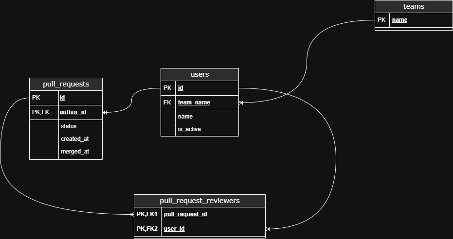

# **Сервис назначения ревьюеров для Pull Request’ов**

## **Условия**

* OpenAPI-спецификация в директории api — `api.yaml`)
* Объём данных умеренный (до 20 команд и до 200 пользователей), RPS — 5, SLI времени ответа — 300 мс, SLI успешности — 99.9%.
* Пользователь с `isActive = false` не должен назначаться на ревью.
* Операция merge должна быть **идемпотентной** — повторный вызов не приводит к ошибке и возвращает актуальное состояние PR.
* Сервис и его зависимости должны подниматься командой **docker-compose up**. Если решение предусматривает миграции, они также должны применяться при выполнении этой команды. Сервис должен быть доступен на порту 8080.

## **Дополнительные задания**

* Добавлен простой эндпоинт статистики (описан в OpenAPI-спецификации).
* Проведено нагрузочное тестирование полученного решения (в директории docs).
* Реализовано E2E-тестирование, файлы для запуска находятся в директории internal/e2e, запуск производится командами:
  *  docker-compose -f .\internal\e2e\compose.yml  up 
  * E2E=true go test -v ./internal/e2e/...
* Конфигурация линтера описана в файле .golangci.yml.

## **Запуск**
 * Сервис:
   * Командой **docker-compose up**
   * Командой make up
 * Тесты:
   * go test ./... --cover
   * Командой make test

## **Стек**

**Язык сервиса:**  Go, для описания сервера использован фреймворк fiber.

**База данных:**  PostgreSQL, драйвер - pgx, запросы реализованы сырым sql.

## **Ход решения**
:warning: Для запуска необходим .env файл. Пример в .env.example :warning:
* При деактивации пользователя происходит попытка переназначить назначенные на него пулл-реквесты другим пользователям.
В случае неудачи ошибка логируется. Пулл-реквесты его авторства остаются неизменными.
* Пользователи имеют единственную команду. При создании новой команды с существующими пользователями они переходят
в новую
* В исходное API добавлена внутренняя ошибка сервера (500)

## **Модель базы данных**

  

